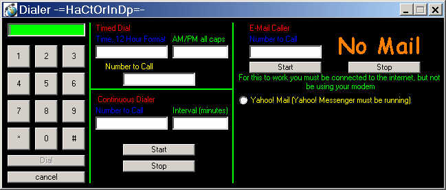



## Advanced Dialer, Dial at a certain time, when you get Yahoo\! Mail, or at an interval\!

### Description

Just by looking at the screen shot you can see what it can do. You can dial a number, you can have it set to dial a number at a certain time, you can leave Yahoo! messenger running and when you get mail have it call a number (beep you), and also dial a number on an interval. This program also minimizes to systray! I squezzed a lil code off from PSC, but I made this program 6 months ago so i don;t remember whos it is, if you realize its yours feel free to e-mail me, and i'll give u credit. Please post feedback and PLEASE VOTE, ENJOY!
 
### More Info
 
when putting in a number to dial, in order for the othe phone to ring, you must at least put in two commas, so the modem doesn;t hang up right away

ie;

5551212,,

thats it, enjoy!

             |
---                |---
**Submitted On**   |2001-02-21 11:39:00
**By**             |[Nick Romanelli](https://github.com/Planet-Source-Code/PSCIndex/blob/master/ByAuthor/nick-romanelli.md)
**Level**          |Intermediate
**User Rating**    |5.0 (10 globes from 2 users)
**Compatibility**  |VB 6\.0
**Category**       |[Complete Applications](https://github.com/Planet-Source-Code/PSCIndex/blob/master/ByCategory/complete-applications__1-27.md)
**World**          |[Visual Basic](https://github.com/Planet-Source-Code/PSCIndex/blob/master/ByWorld/visual-basic.md)
**Archive File**   |[CODE\_UPLOAD152882212001\.zip](https://github.com/Planet-Source-Code/nick-romanelli-advanced-dialer-dial-at-a-certain-time-when-you-get-yahoo-mail-or-at-an-int__1-21216/archive/master.zip)

